# Pakistan Railways Job Portal: Master Flow

Status: Draft. This will change as the portal is developed.

Items tagged **[Proposed]** came out of brainstorming and still need sign-off. Everything else reflects the agreed flow.

> **Current development scope:** sections 1 to 4.9 (admin job flow through candidate application tracking). Section 5 (post-deadline screening) and section 6 (cross-cutting requirements) are **deferred** to a later phase. The data model still reserves the statuses they will use.

## 1. Core Principles

1. **Permanent candidate profile.** Every candidate gets one permanent profile, keyed to their CNIC. It's created at signup, persists across every job and every year, and is never tied to or deleted with a single job. The candidate can update it at any time.
2. **Profile, Job, Application are separate.**
   - Candidate Profile = reusable information
   - Job = specific requirements
   - Application = only the information required for that job
3. **BPS is a classification and filter, not an eligibility rule.** Each job defines its own education, experience, age, domicile, documents and other requirements.
4. **Job requirements are structured data.** Eligibility rules are stored as machine-checkable fields (qualification level, discipline, minimum marks, experience years, age range, domicile, documents) so the application check can compare them against the profile. The job description stays as free text. **[Proposed]**
5. **One data model for both BPS tiers.** Below BPS-15 and BPS-15 and above differ in how data gets entered and which extra sections appear, not in how it's stored. **[Proposed]**
6. **Age is never collected.** It's calculated from DOB, as on the closing date or the cutoff date stated in the advertisement. **[Proposed: cutoff date]**
7. **A candidate never has to complete their entire profile to apply for one job.**

## 2. Actors

- **Requesting department:** needs the post filled
- **Recruitment cell / job creator:** drafts the job (see open question 2)
- **Approvers:** two or more department leads, or a committee
- **Candidate:** applies through the public portal
- **Screening staff:** handle manual scrutiny and document verification **[Proposed]**
- **Testing agency:** in-house or external (see open question 3)

## 3. Admin Flow: Job Creation to Publication

### 3.1 Create Job
- Link to sanctioned post or requisition reference **[Proposed]**
- Title, department, BPS, location, vacancies, employment type
- Job description (free text)
- Structured eligibility rules: education, discipline, minimum marks, experience, age range, age relaxation rules, domicile **[Proposed: structured]**
- Required documents
- Quota breakdown (merit, provincial/regional, women, minority, disability), per federal rules **[Proposed]**
- Application fee, if any **[Proposed]**
- Opening date and closing date

### 3.2 Approval
- Approved by two or more department leads or a committee
- Approval rule to define: sequential or parallel, all approvers or N of M **[Proposed]**
- Outcomes: Approved, Returned with comments (back to draft), Rejected **[Proposed]**
- Every action recorded in an audit trail **[Proposed]**

### 3.3 Publish
- Job is locked once approved. **Once published, a job is final: it can't be edited and there is no corrigendum process.**
- Advertisement number assigned, newspaper advertisement attached **[Proposed]**
- Scheduled publish on the opening date, auto-close at the deadline **[Proposed]**
- Job becomes visible on the candidate portal

## 4. Candidate Flow

### 4.1 Landing / Job Search
- Search jobs
- Latest jobs
- Filters: BPS, department, location, education, employment type, deadline

### 4.2 Job Details
- Job title, department, BPS, location
- Vacancies and deadline
- Eligibility requirements
- Job description
- Required documents
- Apply

### 4.3 Signup / Verification
- CNIC
- Mobile number
- CAPTCHA
- OTP
- NADRA CNIC verification if integration is available, otherwise format validation and duplicate check **[Proposed]**
- OTP rate limiting and OTP-based account recovery **[Proposed]**
- Successful signup creates the candidate's **permanent profile**

### 4.4 Permanent Candidate Profile
Reusable, section-based, one per CNIC.

- **Personal:** Name, CNIC, father/guardian name, DOB, gender, nationality
- **Contact and Address:** Phone, email, current/permanent address
- **Domicile:** Province, district, certificate (district maps to quota zone **[Proposed]**)
- **Education:** Qualification, subject, institution, year, result, certificate, attested degrees
- **Experience:** Organization, designation, dates, experience certificate
- **Skills/Certifications:** Only relevant skills and licenses
- **Documents:** Passport-size photo, character certificate
- **Additional Eligibility:** Government employee, disability, minority, NOC, etc. Shown only when applicable.

Profile behaviour:
- Persists permanently and is reused for every application
- Edits never change already-submitted applications (see 4.8)
- Document vault: upload once, reuse across applications, with file size and format limits and client-side compression **[Proposed]**
- Edit history kept for audit **[Proposed]**

### 4.5 Tier Split by BPS

**Below BPS-15: form-based**
- Candidate fills the section-based profile forms directly
- Mobile-first layout and Urdu support prioritized for this tier **[Proposed]**

**BPS-15 and above: resume-based**
- Option A: upload resume, system parses it and prefills the permanent profile
- Option B: build resume from scratch using the builder
- Parsed data goes into the same structured profile, and the candidate confirms each section before it's used **[Proposed]**
- Low-confidence parsed fields are highlighted **[Proposed]**
- If parsing fails (e.g. scanned image), candidate lands in the builder with whatever was extracted **[Proposed]**
- Builder writes to the same schema and can export a formatted PDF **[Proposed]**
- Extra sections for this tier: professional registration (e.g. PEC for engineering posts), publications/research, references, statement of purpose **[Proposed]**
- Eligibility still runs on structured fields. The resume is supporting material, not the eligibility source. **[Proposed]**

### 4.6 Application Check
Compare Job Requirements against the Candidate Profile. Show only what's missing:

```
✓ Education
✓ Domicile
✓ Age
✕ Experience Certificate: Required
```

- Candidate fills only the missing items
- Anything filled here is saved back to the permanent profile for reuse **[Proposed]**

### 4.7 Review and Submit
- Show complete application
- Section-wise edit
- Required documents
- Eligibility confirmation
- Fee payment (online or challan upload), if the job has a fee **[Proposed]**
- Declaration
- Submit application

### 4.8 Application Snapshot **[Proposed]**
- On submit, the relevant profile data is frozen into an application snapshot
- Later profile edits don't affect submitted applications
- One application per CNIC per job; applying to multiple jobs is allowed
- **Submitted applications are final: they can't be edited or withdrawn.**

### 4.9 Application Tracking
- Application ID
- Submitted
- Under Review
- Test/Interview
- Final Status

Expanded statuses **[Proposed]**:
Submitted, Under Review, Rejected (with reason), Shortlisted, Admit Card Issued, Test/Interview, Result, Merit List, Document Verification, Medical, Offer.

## 5. Post-Deadline Screening **[Proposed]**

1. Job auto-closes at the deadline
2. Auto-screening against the job's structured rules
3. Flagged cases (e.g. self-declared eligibility the system couldn't verify) go to manual scrutiny
4. Eligible / Rejected with reason
5. Shortlist published
6. Objection window
7. Admit card / roll number slip issued, with test center selection if applicable
8. Test and/or interview (in-house or external agency, see open question 3)
9. Quota-wise merit list generated and published
10. Objection window
11. Document verification
12. Medical
13. Offer letter

## 6. Cross-Cutting Requirements **[Proposed]**

- SMS and email notification on every status change
- Urdu and English support
- Mobile-first, low-bandwidth friendly
- Full audit trail on admin actions (creation, approval, publication, screening decisions)
- Reports per job: applications received, eligible, shortlisted, quota-wise breakdown

## 7. Data Model Overview **[Proposed]**

| Entity | Purpose |
|---|---|
| CandidateProfile | Permanent, one per CNIC, reusable across all jobs |
| ProfileSection | Personal, contact, domicile, education, experience, skills, documents, additional eligibility |
| Document | Stored once in the vault, referenced by profile and applications |
| Job | Details, BPS, quota breakdown, status, advertisement number |
| JobRequirement | Structured eligibility rules for one job |
| ApprovalRecord | Each approver's action and comments |
| Application | Links candidate to job, holds status |
| ApplicationSnapshot | Frozen profile data at submission |
| StatusEvent | Every status change, drives tracking and notifications |

## 8. Flow Diagram

```mermaid
flowchart TD
    subgraph ADMIN["Job Creation and Approval"]
        A1["Department raises requisition"] --> A2["Create job draft"]
        A2 --> A3["Define structured requirements, quotas, documents"]
        A3 --> A4{"Approval by 2+ leads or committee"}
        A4 -- "Returned with comments" --> A2
        A4 -- "Rejected" --> A5["Job closed as rejected"]
        A4 -- "Approved" --> A6["Job locked and scheduled"]
        A6 --> A7["Job published with advertisement number (final, no edits)"]
    end

    subgraph CAND["Candidate Portal"]
        C1["Landing and job search"] --> C2["Job details"]
        C2 --> C3{"Has account?"}
        C3 -- "No" --> C4["Signup: CNIC, mobile, CAPTCHA, OTP"]
        C4 --> C5["Permanent candidate profile created"]
        C3 -- "Yes" --> C6["Login with OTP"]
        C5 --> C7{"Job BPS tier"}
        C6 --> C7
        C7 -- "Below BPS-15" --> C8["Section-based profile forms"]
        C7 -- "BPS-15 and above" --> C9{"Resume input"}
        C9 -- "Upload resume" --> C10["Parse resume and prefill profile"]
        C10 --> C11{"Parse successful?"}
        C11 -- "Yes" --> C12["Candidate confirms parsed sections"]
        C11 -- "No" --> C13["Resume builder"]
        C9 -- "Build from scratch" --> C13
        C12 --> C14["Higher-tier sections: registration, publications, references"]
        C13 --> C14
        C8 --> C15["Application check: job rules vs profile"]
        C14 --> C15
        C15 --> C16{"Anything missing?"}
        C16 -- "Yes" --> C17["Show only missing items"]
        C17 --> C18["Saved back to permanent profile"]
        C18 --> C15
        C16 -- "No" --> C19["Review application, section-wise edit"]
        C19 --> C20["Fee payment if applicable"]
        C20 --> C21["Eligibility confirmation and declaration"]
        C21 --> C22["Submit: snapshot created, application ID issued"]
    end

    A7 --> C1

    subgraph POST["Screening and Tracking"]
        P1["Deadline reached, job auto-closes"] --> P2["Auto-screening against job rules"]
        P2 --> P3{"Flagged for review?"}
        P3 -- "Yes" --> P4["Manual scrutiny"]
        P4 --> P5{"Eligible?"}
        P3 -- "No" --> P5
        P5 -- "No" --> P6["Rejected with reason"]
        P5 -- "Yes" --> P7["Shortlist published"]
        P7 --> P8["Objection window"]
        P8 --> P9["Admit card issued"]
        P9 --> P10["Test and/or interview"]
        P10 --> P11["Quota-wise merit list"]
        P11 --> P12["Objection window"]
        P12 --> P13["Document verification"]
        P13 --> P14["Medical"]
        P14 --> P15["Offer letter"]
    end

    C22 --> P1
    N1["SMS and email on every status change"]
    P6 -.-> N1
    P7 -.-> N1
    P9 -.-> N1
    P11 -.-> N1
    P15 -.-> N1
```



## 9. Open Questions

1. Is BPS-15 the right tier boundary, or should it be BPS-16, where posts start looking more officer-like?
2. Who creates the job: the department that needs the post, or a central recruitment cell on its behalf?
3. Is the written test conducted in-house or by an external testing agency?
